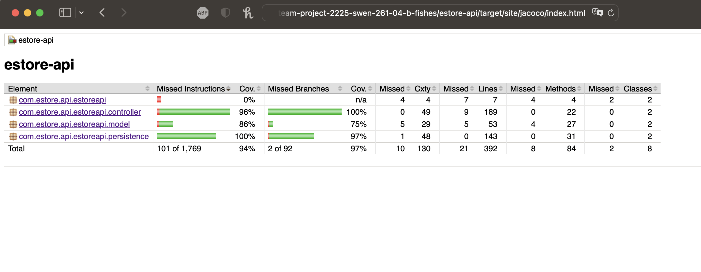

# PROJECT Design Documentation

> _The following template provides the headings for your Design
> Documentation.  As you edit each section make sure you remove these
> commentary 'blockquotes'; the lines that start with a > character
> and appear in the generated PDF in italics._

## Team Information
* Team name: b-fishes
* Team members
  * Cristian Malone
  * Connor McRoberts
  * Harbor Wolff

## Executive Summary

Our rare fish e-store is a cutting-edge platform designed to provide customers with an easy-to-use and secure online shopping experience. The website is built using a single-page application (SPA) architecture, utilizing the Angular framework for the front-end and Java Springboot for the back-end. This technology combination enables us to provide a fast, responsive and dynamic user interface.

The website allows users to create an account and log in. Once logged in, users can browse our extensive selection of rare fish, view detailed product information, and add their desired fish to their shopping cart. The shopping cart is designed to be user-friendly, allowing users to easily edit and update their orders before checkout.

The website also features an admin login, providing the administrators with a secure back-end portal to manage product information, customer data, and order fulfillment. Administrators can add, edit, and remove products, view and manage customer data, and process orders, ensuring the website's operations run smoothly.

In conclusion, our rare fish e-store offers customers an exciting and hassle-free shopping experience. With our extensive selection of rare fish, user-friendly shopping cart, we are confident that our customers will enjoy shopping with us.

### Purpose
> The purpose of this project is to allow customers to purchase their favorite
> exotic fish, all while our product owner gets to make some profit while providing 
> a needed service.

### Glossary and Acronyms
> _Provide a table of terms and acronyms._

| Term | Definition |
|------|------------|
| SPA | Single Page |

## Requirements

> The store owner should have complete control of the displayed inventory. 
> This includes updating, adding, and deleting items from the inventory.

> The users of the store should be displayed the inventory on a home page.
> From this homepage the users should be able to view individual items in the
> store with greater detail (reviews, extra info, etc.). The user also have the ability
> to log in with a unique username and password

> Once at the detailed item page, the user should have a functional shopping cart.
> Where they can add, delete items from their cart.
> The cart is persistant and will remain with the user throughout multiple sessions.

> When a user clicks the cart icon, they will see the items in their cart,
> and they will be given the option to checkout. 

### Definition of MVP
> Fully functional e-store application as mentioned in the section above.
> A reward points system made for users.
> A review system below each item detail page

### MVP Features
> Each fish bought from our store = 1 point
> Upon a user having more than 10 points, they can receive 1 item for free.
> Every user has the ability to leave a review under each item, and update it as they see fit.

### Roadmap of Enhancements
> Only allow users who purchase the item to review it
> Allow reviews to contain more than just an integer 1-5. Contain a long string for the review.

## Application Domain

This section describes the application domain.

> _Provide a high-level overview of the domain for this application. You
> can discuss the more important domain entities and their relationship
> to each other._

## Architecture and Design

This section describes the application architecture.

### Summary of Object Oriented Design Principles

Here we have outlined 4 Object-Oriented principles we utilized in the creation of this project, and how those principles directly apply to our code

 I: Single Responsibility
Per wikipedia, "A module should be responsible to one, and only one, actor.” Single Responsibility dictates that a program should have all of its modules (classes in Java) perform a single purpose; therefore, a program should be made up of many specialized modules rather than a single, omnipotent one. This preference towards simplicity helps prevent programs from becoming chaotic systems where a single error thrown can cause the whole code to crash, rather than be dealt with on a case-to- case basis.
For example, we used this principle in our “cart- component” class in our angular code. The cart component module is exclusively responsible for showing the user’s cart and storing the methods needed to operate it; any other functionality is stored elsewhere in the code.
II: Information Expert
Similar to Single Responsibility, Information Expert dictates that all responsibilities regarding a certain function should be delegated to the class which holds the most information about that function. For example, you wouldn’t ask a physicist to how to compose a symphony and you wouldn’t ask a pianist how to build a rocket. This helps the program avoid redundancy in class communication as well as make it easier for humans to trace back through the code.

 We utilize this principle in our UserController class, for example. The User’s cart is stored as a field in the User class, and therefore the methods associated with interacting with the cart are stored in the UserController as that is the class that has the most information on the User and its cart.
III: Low Coupling
Low Coupling is demonstrated in our code design by ensuring minimally-required inheritance or imports between classes. All of our Model, Controller, and Persistence program files only interact with each other when required, and all of these interactions occur directly. The
Model Package is the lowest level of abstraction, where the Product.java file does not import any other custom classes. In the Controller package, the ProductController file imports functions from the Model to create Product objects, and the ProductDAO interface to manipulate the JSON file information. In the Persistence package, the ProductDAO interface only imports the Model, and the ProductFileDAO imports the Model and implements the ProductDAO interface. This creates a very linear, direct system of inheritance between our Java classes. In order to maintain or improve this concept’s presence in our code, we should ensure that functions or code sections added in the future should not require unnecessary additional imports. If further communication between the Java classes are needed,

 mirrored functions should be added across the classes to maintain this inheritance structure.
Another example of Abstraction and Low Coupling is the fact that the reviews are stored using usernames (rather than User objects) in the map. By holding only relevant data as opposed to an object itself, the system prevents itself from being reliant on the User.java interface.
IV: Controller
In our project, we utilize a Controller java class, ProductController, to initially handle curl commands from the terminal. Later on in the project development, this class will directly handle user requests from the Angular UI. When the user commits any action, whether through the UI or the terminal, the ProductController class is the first Java class to process it. Based on the given command, it then calls functions from the Persistence package to actually collect or modify data. In order to maintain or improve this concept’s presence in our code, we should properly implement the Angular UI and ensure that user requests are still sent to the Controller directly. For the rest of the project, we should also ensure that no other custom Java class comes between reading input from the user, and the controller package.

### Summary

The following Tiers/Layers model shows a high-level view of the webapp's architecture.

The e-store web application, is built using the Model–View–ViewModel (MVVM) architecture pattern. 

The Model stores the application data objects including any functionality to provide persistance. 

The View is the client-side SPA built with Angular utilizing HTML, CSS and TypeScript. The ViewModel provides RESTful APIs to the client (View) as well as any logic required to manipulate the data objects from the Model.

Both the ViewModel and Model are built using Java and Spring Framework. Details of the components within these tiers are supplied below.

### Overview of User Interface

> The user iterface contains 5 pages.

> The home page contains a login button, the inventory.

> The item detail page contains the item, user reviews, and a 'add to cart' button

> The cart page contains the items that the user has added to the cart, the rewards points the user has and a 'checkout' button.

> The login pager and the create account pages both contain fields for the users to enter in information. Such as username and password.

### Note for the admin these pages may look different.
> Item Detail page

> Checkout page

> Login page

> Inventory page

### View Tier
> Our view tier follows a SPA architecture, using the best pratices perscribed by angular.

> For example we use app-routing to choose what components to display

> We store all 'logic' functions, and anything that deals with the api in services (see: product.service, login.service)

> Components store the data that they display, and call upon services for any data that needs external tools. 

> _You must also provide sequence diagrams as is relevant to a particular aspects 
> of the design that you are describing.  For example, in e-store you might create a 
> sequence diagram of a customer searching for an item and adding to their cart. 
> Be sure to include an relevant HTTP reuqests from the client-side to the server-side 
> to help illustrate the end-to-end flow.

>Checking out

>Searching for an item

### ViewModel Tier
Our ViewModel Tier consists of four files, two in the API and two in the Angular UI. In the API,
the ProductController.Java and UserController.Java files consist of functions that correspond
to every possible user interaction. When an interaction occurs, a function in the controller first
checks to see if that interaction was valid. If so, the function will call the corresponding
function in the persistance files to actually modify or retireve data, and return an HTTPStatus
of OK. Otherwise, the function will return an HTTPStatus that corresponds to that specifc error
with the request and notify the user of it.

In the UI, the ProductService and LoginService are responsibel for connecting the API to the 
user interface. When users interact with the website through the UI, each service contains the
URI to Controller mappings, and use them to call the specific HTTP controller functions that
correspond the user's action. This way, both the website UI and JSON information will update
at the same time.

### Model Tier
This tier of the design contains six Java files on the API side of the program's operation. Two 
files in the Model Tier, Product.Java and User.Java, directly retrieve and manipulate data from 
Product and User objects. For Product.java, each Product object contains an Integer id, a String 
name representing its name, a String info representing a description of the product, an Integer 
price representing its price, an Integer quantity representing the product's quantity, a String 
imgSource representing a link to the corresponding image for a product to be displayed, and a 
Map<String,Integer> representing the reviews for that product. The rest of the program is filled 
with various getters and setters for each attribute. For User.Java, each User object contains an
Integer id, a String username representing the user's username, a String password representing the
user's password, a Boolean isAdmin to indicate if the user has admin privileges, an Integer array
holding the Product ids of products in the user's cart, and an Integer rewards representing the 
user's current rewards points. Again, the rest of the program is filled with various getters and 
setters for each attribute.

The other four files deal with persistence. They call functions from the object classes to update 
the contents of the JSON files, which contain Product and User object information currently 
avaialble to the user. ProductDAO.java and UserDAO.Java are interfaces, while ProductFileDAO.java 
and UserFileDAO.Java implement those intefaces to actually modify data. Corresponding functions 
from the controller files call these functions whenever a user interacts with the website. Each 
FileDAO contains a String filename referencing the corresponding JSON, and an array of either
Product or User Objects representing the local instantiation of the current Products or User.
Whenever a function call is made, it updates the locally instantiated array and saves its contents
to the corresponding JSON file.

### Static Code Analysis/Design Improvements
> _Discuss design improvements that you would make if the project were
> to continue. These improvement should be based on your direct
> analysis of where there are problems in the code base which could be
> addressed with design changes, and describe those suggested design
> improvements._

One design improvement that we would make to our code base if given more time would be to implement
more unit tests. During our last Code analysis, our current coverage was only 77%. We have unit tests
in place to check for the correct operation of every function in the API, and they all pass. However,
for some of our features added in later Sprints, we did not have time to implement tests for other
HTTP Status results or failures of functions. This is most likely where our lack of coverage comes
from, and we would want to increase that coverage if possible.

Another design improvement that we would make to our code base if given more time would be to implement
more security and error handling in the API code. In the UI, we prevented elements or buttons from 
displaying to users in scenarios where errors could occur. For example, A user cannot look at their cart 
or add items to their cart without being logged in, because user that is not logged in does not have an 
existing cart, so adding an item to a cart would result in an error. Therefore, the website does not 
display those options to the user until they are logged in. However, if a user were to somehow bypass
these conditional displays, they could cause these errors to occur and there may not be a way to recover
from them. Most of the functions in the API have error piping, but some do not. Therefore, if more time
was given to increase encryption on accessing website elements and implement more error piping, that 
would definitely be ideal.

A third design improvement that we would like to make to our code base if given more time is to improve 
UI of the user review system. The button system for creating and editing reviews is very usable and
aesthetically pleasing. However, the display of the reviews themselves is relatively bland, displaying
only the user's name and their rating as a number out of five. If possible, we would make this display
more clear and complimentary to the website's visuals. We could potentially represent the user's 
reviews as stars or other icons, or even add an option for user's to describe their review in text.

> _With the results from the Static Code Analysis exercise, 
> discuss the resulting issues/metrics measurements along with your analysis
> and recommendations for further improvements. Where relevant, include 
> screenshots from the tool and/or corresponding source code that was flagged._

## Testing
> _This section will provide information about the testing performed
> and the results of the testing.

 TESTS WRITTEN:
 getProduct, createProduct, updateProduct, getProducts, searchProducts, deleteProduct
 getReview, createReview, editReview, deleteReview
 findUser, createUser
 addProductToCart, removeProductFromCart, showCart
 checkout, getRewardsPoints, useRewardsPoints, notEnoughRewardsPoints
 
RESULTS:
All written tests have passed.

### Acceptance Testing
> _Report on the number of user stories that have passed all their
> acceptance criteria tests, the number that have some acceptance
> criteria tests failing, and the number of user stories that
> have not had any testing yet. Highlight the issues found during
> acceptance testing and if there are any concerns.

We currently have an average coverage of ~94% with all necessary methods being tested.

### Unit Testing and Code Coverage
> _Discuss your unit testing strategy. Report on the code coverage
> achieved from unit testing of the code base. Discuss the team's
> coverage targets, why you selected those values, and how well your
> code coverage met your targets. If there are any anomalies, discuss
> those.

Our targets for testing are every single API call possible on the backend.  This is to ensure that the Client can reliably make HTTP
requests during runtime without having to worry about unexpected or improper functionality.  Currently, our code coverage is adequate but unideal.  
We are missing testing on a few trivial methods (such as setters within the controller classes), so we are currently focused on ensuring we have (nearly)
complete coverage.
